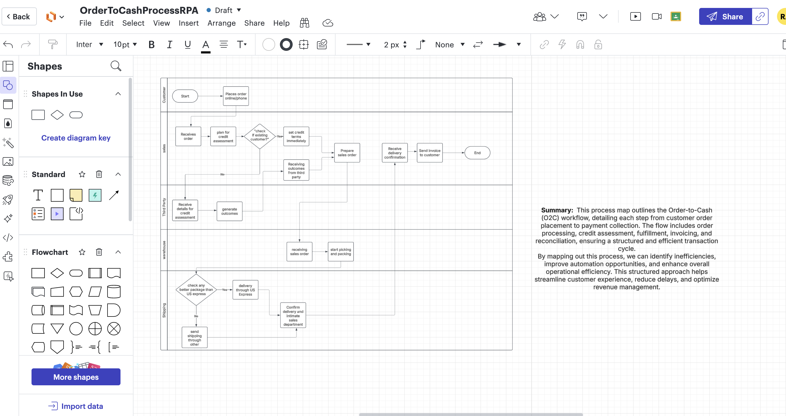
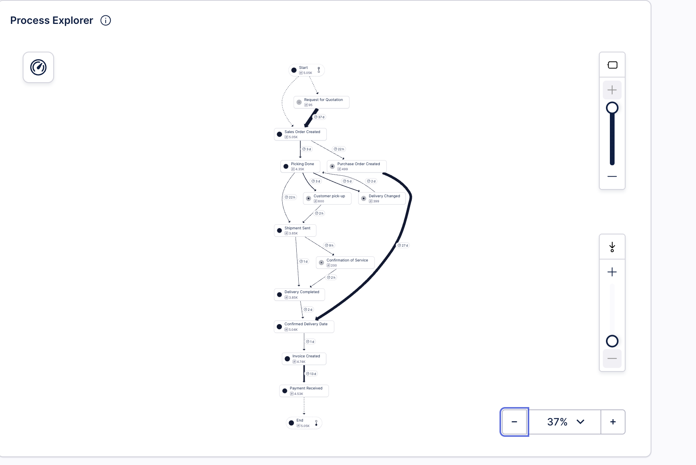
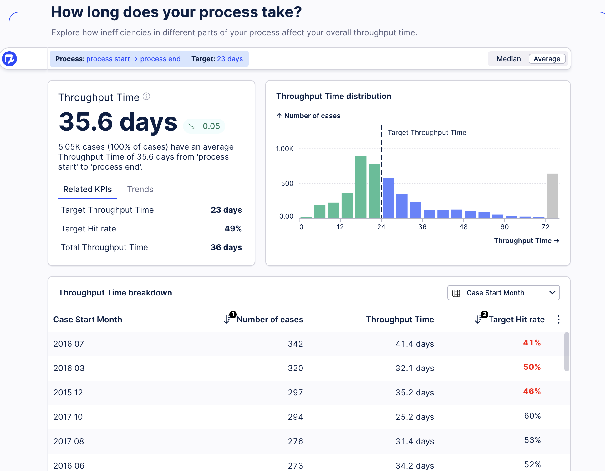
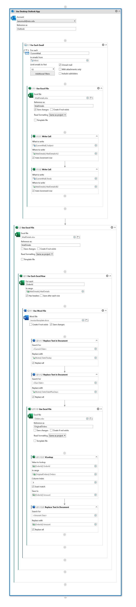

# Robotic Process Automation (RPA): Automating Invoicing for a Fictional Client

This project simulates a real-world consulting scenario where I act as a **Robotic Process Automation (RPA) consultant** hired by **Bolt Socks**, a **fictional wholesale sock supplier**, to streamline their **Order-to-Cash (O2C)** process. The focus was to **analyze inefficiencies** using process mining and build an **automated invoicing solution** using **UiPath**.

---

## 🧠 Project Overview

Bolt Socks was facing delays in generating invoices after confirming deliveries, leading to **cash flow issues**. The simulated goal was to:

- **Visualize the current process** using **Lucidchart**
- **Identify inefficiencies** using **Celonis Process Mining**
- **Automate invoice generation** using **UiPath Studio**

The automation focused on reducing the **manual lag between delivery and invoicing**, ultimately accelerating the order-to-cash cycle.

---

## 🛠️ Tools Used

- **Lucidchart** – for process mapping  
- **Celonis Snap** – for process mining  
- **UiPath Studio** – for robotic process automation  
- **Microsoft Outlook 365 + Excel + Word** – for email handling and invoice creation  

---

## 👤 My Role

As the sole consultant, I led this project **end-to-end**:

1. **Mapped** the as-is O2C workflow from interview transcripts using Lucidchart  
2. **Mined and analyzed** the process using real event logs in Celonis  
3. **Developed** an RPA solution using UiPath Studio to generate and email invoices  
4. **Presented** a summary report and visuals to explain findings and automation outcomes

---

## 🧾 Process Mapping (Lucidchart)

Visual representation of the existing order-to-cash workflow, built using stakeholder interviews.

---

## 🔍 Process Mining Analysis (Celonis)

### 📊 Celonis Overview

Analyzed ~5,050 cases and 12 activities to identify bottlenecks.

### 🔁 Process Flow Explorer

The main insight: **delays of over a day** between delivery confirmation and invoice creation.

---

## 🤖 UiPath Automation Workflow

The automated bot scans Outlook for delivery confirmation emails, matches them to the orders list, and creates & emails personalized invoices. Steps include:

- Extracting dynamic fields like date, due date, and amount
- Filling a **Word template**
- Saving invoices as PDFs
- Sending them via **Outlook**
- Moving processed emails to an "RPA" folder

### 🧠 UiPath Workflow

### 📄 Sample Automated Invoice through Email Confirmation

---

## 📁 Files Included

| File | Description |
|------|-------------|
| `OrderToCashProcessRPA.pdf` | documentation of the flow|
| `UiPathAutomatedMail.pdf` | Sample output of automated invoice email |
| `LucidChart.png` | As-is process map of the O2C workflow |
| `CelonisOverview.png` | Dataset stats and throughput summary |
| `CelonisProcessMining.png` | Process flow and bottleneck identification |
| `Celonis.png` | Showing What does your process look like?|
| `UiPathProgress.jpg` | UiPath Studio bot logic snapshot |

---

## ✅ Key Takeaways

- Simulated a **real-world consulting engagement** using RPA and process mining  
- Identified and addressed a measurable **process inefficiency**  
- Designed a **scalable automation workflow** with UiPath Studio  
- Learned how to bridge **business problem solving with technology**  

---

## 📬 Let’s Connect!

If you're working on something exciting in **automation, analytics, or innovation**, I’d love to chat!

📧 [Email me](mailto:arma.rahamath@gmail.com)  
🔗 [LinkedIn](https://www.linkedin.com/in/armashaik)  
💻 [More Projects](https://github.com/ArmaShaik)

---
